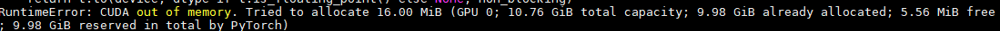

# 互联网数据挖掘 project Boolean-Question

<p align="right" style="line-height: 33px; font-size: 15px; "> 13 组 <br>李心怡  刘宇晗  宁淳 </p>


## 0. 项目结构总览

总体模型结构如下图所示：


其中，图的左侧为输入的文章标题、内容与人类提出的自然问题；图的中部为我们小组所设计的 Pipeline 结构；输入经过我们所设计的 Pipeline 结构，将输出由开放式评测模型生成的模型结果。

其中我们的 Pipeline 结构，根据评测方式分为两部分：封闭式测试模型与开放式测试模型。

封闭式测试模型架构为`bidirestional LSTM with attention`，详见 `2.2` 节。

开放式测试模型架构为多 $Transformer$ 的集成学习模型，详见第 $3$ 章。

无论是封闭式测试模型还是开放式测试模型，输入数据都需要经过预处理，并且我们在两个模型上进行了针对训练集的数据增强实验。

项目代码地址请见 https://github.com/jszyxw/boolq-project.

## 1. 数据增强

我们使用了两种方式尝试数据增强，然而两种方式均需要不同程度的手工成本，因此我们仅进行了少量数据的添加，在后面我们默认使用数据增强后的数据集。


### 1.1 基于问题生成的数据增强


基于问题生成的数据增强如上图所示。训练一个问题生成模型，输入文章、标题、问题答案，输出一个问题以及其置信度。

处于方便，我们直接使用了[开源代码]([generate_boolean_questions_using_T5_transformer](https://github.com/ramsrigouthamg/generate_boolean_questions_using_T5_transformer))在`boolQ`[^2]数据集上进行模型训练，训练后的模型样例输入输出如下：

`Context`: 

> Months earlier, Coca-Cola had begun “Project Kansas.” It sounds like a nuclear experiment but it was just a testing project for the new flavor. In individual surveys, they’d found that more than 75% of respondents loved the taste, 15% were indifferent, and 10% had a strong aversion to the taste to the point that they were angry.

`Most accurate questions`:

> Does coca cola have a kansas flavor?
> Is project kansas the same as coca cola?
> Is project kansas a new coca cola flavor?

然而由于`boolQ`数据集训练量较少（~10k) ，问题生成的质量并不高，需要人工鉴别出符合文章内容的问题，并确认答案是否正确。我们人工检查确认了1000多条数据，清洗出500个新问题数据，新问题所对应的文章均取自于训练集。

### 1.2 基于问题扰动的数据增强[^3]


方法如上图所示，对于一个问题的某个部分进行一定程度上的改变，同时要求答案也尽量改变，通过这种方法构造数据以提高模型的鲁棒性，具体参考论文[^3]。我们尝试使用这种方法生成了200条新数据。然而使用这种方法进行数据扩充，对模型的推理能力要求更高，在低资源的封闭式测试中，加入新数据进行模型训练效果反而会变差。

## 2. 封闭式

### 2.1 预处理

1. 将原始的 `jsonl` 文件处理成可训练的 sample

   1. 输入为`question $ (title) passage`的格式，标签为`answer`
   2. 统一转化为小写
   3. 除去`数字`、`字母`以及用来标记输入格式的`(`，`)`，`$`以外的字符
   4. 动词还原为基本形态
   5. 删除属于停用词表的词

   示例如下表：

   | Attri | Value |
   | ----- | ------------------------------------------------------------ |
   | INPUT | ['iran', 'afghanistan', 'speak', 'language', '$', '(persian', 'language)', 'persian', '(', 'p', 'r', 'n', 'n', ')', 'also', 'know', 'endonym', 'farsi', '(', 'f', 'rsi', '(f', 'si', ')', '(', 'listen))', 'one', 'western', 'iranian', 'languages', 'within', 'indo', 'iranian', 'branch', 'indo', 'european', 'language', 'family', 'primarily', 'speak', 'iran', 'afghanistan', '(officially', 'know', 'dari', 'since', ')', 'tajikistan', '(officially', 'know', 'tajiki', 'since', 'soviet', 'era)', 'regions', 'historically', 'persianate', 'societies', 'consider', 'part', 'greater', 'iran', 'write', 'persian', 'alphabet', 'modify', 'variant', 'arabic', 'script', 'evolve', 'aramaic', 'alphabet'] |
   | Label | True                                                         |
   
2. 用预训练词向量`GloVe`做`word embedding`。经过实验测试，超参数设为 $dim=100$ 时效果较好。

### 2.2 模型搭建

### 2.2.1 模型架构

模型架构为`bidirestional LSTM with attention`，参考了 $ACL2016$ 的一篇文章`Attention-Based Bidirectional Long Short-Term Memory Networks for Relation Classification`[^1]，在当时与封闭集评测条件类似的条件下，获得了当时 state of the art 的结果，模型整体结构如下：


### 2.2.2 变种 LSTM

参考论文[^1]，模型中的 LSTM 为变种 LSTM，其主要思想为：在原 LSTM 的基础上，**各个门也将上一个记忆单元考虑上**。修改后各门的具体计算方式如下：
$$
\begin{aligned} i_{t} &=\sigma\left(W_{x i} x_{t}+W_{h i} h_{t-1}+W_{c i} c_{t-1}+b_{i}\right) \\ f_{t} &=\sigma\left(W_{x f} x_{t}+W_{h f} h_{t-1}+W_{c f} c_{t-1}+b_{f}\right) \\ g_{t} &=\tanh \left(W_{x c} x_{t}+W_{h c} h_{t-1}+W_{c c} c_{t-1}+b_{c}\right) \\ c_{t} &=i_{t} g_{t}+f_{t} c_{t-1} \\ o_{t} &=\sigma\left(W_{x o} x_{t}+W_{h o} h_{t-1}+W_{c o} c_{t}+b_{o}\right) \\ h_{t} &=o_{t} \tanh \left(c_{t}\right) \end{aligned}
$$

### 2.2.3 Attention Layer

Attention层按如下公式计算：
$$
M =\tanh (H)\\ \alpha =\operatorname{softmax}\left(w^{T} M\right) \\ r =H \alpha^{T} \\ h^{*} =\tanh (r)
$$
其中，H 是 $BiLSTM$ 的输出，H 首先通过 $tanh$ 函数激活得到 M, 再通过 全连接层 + softmax 层 得到。然后 H 乘以权重，得到输出 r  。最后经过  $tanh$ 函数激活得到最后输出 h。得到输出后，直接作为 softmax层的输入，就可以得到相应预测标签的输出。

### 2.3 训练过程

训练过程中尝试为微调了`embedding dimension`（见 `2.1` 节）及下表中参数，其中`dropout prob`、`batch size`、`lr`对最终结果的稳定性影响较大，其余参数对训练结果影响不大。最终结果大部分均能在 10 个 `epoch` 以内稳定在 $accuracy > 65%$, $f1 \approx 50\%$。

微调后的参数如下：

| 参数               | 参数值                                 |
| ------------------ | -------------------------------------- |
| 隐藏层维度         | 200                                    |
| 注意力层维度       | 120                                    |
| LSTM层数           | 2                                      |
| Dropout probabiliy | 0.5                                    |
| batch size         | 128                                    |
| epoch              | 20，保存验证集 accuracy 最高的模型参数 |
| loss               | $BCEloss$                              |
| optimizer          | $Adam(lr=0.001, betas=(0.9, 0.999))$   |

### 2.4 训练结果

训练集与验证集结果如下表：

|        | accuracy | F1-score | precision | recall |
| ------ | -------- | -------- | --------- | ------ |
| 训练集 | 98.621   | 98.158   | 98.858    | 97.467 |
| 验证集 | 67.003   | 51.331   | 58.061    | 45.998 |

测试集结果：见 `result/close_result.txt`

上表中的训练集未加入进行问题扰动型数据增强的数据，训练集加入问题扰动型数据增强的数据后，模型训练结果明显变差，原因可能是 LSTM 模型无法承担如此复杂的、带有推理性质的语法解析任务；因此，基于Transformer结构的模型、图神经网络等具有更强语法解析能力、更具推理能力的模型可能对问题扰动更加有效。

## 3. 开放式

### 3.1 预处理

将原始的 `jsonl` 文件导入，并将标题信息融入到文章中，详见 `/code/Preprocese.py`:

```python
... 
    x = json.loads(line)
    x['passage'] = "(" + x['title'] + ") " + x['passage']
...
```

### 3.2 模型结构

整体模型结构如下图所示：


### 3.2.1 Albert 模型

#### 模型结构

相比于 BERT 模型，ALBERT[^7] 使用了如下 3 个 Trick：

- 对于 word Embedding 进行了因数分解，将单词先投影到低维的 embedding 空间 E，再投影到高维的隐藏空间 H，使得 E 的维度可以不与 H 绑定，大大减少了 embedding 矩阵的的维度（从 $V*H$ 减少至 $V*E+E*H$）
- 参数共享，让每一层都使用相同的参数，这样可以大幅度减少参数量（最重要的减少参数量方式），但实际上我们可以看出，虽然谈论的是轻量级，论文中也是给出了 xxlarge 的高参数量版本，毕竟低参数实验不好看。(PS by 宁淳：参数共享我认为本身就是一个宽度和深度的权衡问题，真有多work我认为也不一定会有太大作用。）
- SOP任务的提出：对于 Bert 所提出的 NSP 任务，很多后续模型都已经证明其的不适用性。主要在于 NSP 选取不同文档的句子，会导致在预测过程中，不一定单纯的预测句子之间的连贯性，还会很大程度受到不同文档间 topic 的影响。而 SOP 任务反例为两个连续句子的逆序，就能解决这一问题。

#### 实验结果

我们使用 `Albert-xxlarge` 预训练模型，对 BoolQ 任务进行进一步调参，具体代码请见 `code/train-albert.py`

训练过程中尝试微调了下表中参数，其中`dropout prob`、`batch size`、`lr`对最终结果的稳定性影响较大，其余参数对训练结果影响不大。最终结果大部分均能在 10 个 `epoch` 以内稳定在 $accuracy > 87%$, $f1 \approx 90\%$。

微调后的参数如下：

| 参数               | 参数值                                 |
| ------------------ | -------------------------------------- |
| 隐藏层维度         | 200                                    |
| 注意力层维度       | 120                                    |
| LSTM层数           | 2                                      |
| Dropout probabiliy | 0.1                                    |
| batch size         | 32                                     |
| epoch              | 15，保存验证集 accuracy 最高的模型参数 |
| loss               | $CEloss$                               |
| optimizer          | $AdamW, lr=1e-5, eps=1e-8$             |

验证集上的结果如下：

|        | accuracy | F1-score | precision | recall |
| ------ | -------- | -------- | --------- | ------ |
| 验证集 | 87.49    | 90.01    | 91.24     | 88.93  |

### 3.2.2 RoBERTa 模型

#### 模型结构

在原始 Bert 模型的基础上，RoBERTa[^6] 通过实验，证明了如下几点：

1. 进一步增加预训练数据数量，能够改善模型效果；
2. 延长预训练时间或增加预训练步数，能够改善模型效果；
3. 急剧放大预训练的每个Batch的Batch Size，能够明显改善模型效果；
4. 拿掉预训练任务中的Next Sentence Prediction子任务，它不必要存在；
5. 输入文本的动态Masking策略有帮助.

#### 实验结果

我们使用 `RoBERTa-large` 预训练模型，对 BoolQ 任务进行进一步调参，具体代码请见 `code/train-roberta.py`

训练过程中尝试微调了下表中参数，其中`dropout prob`、`batch size`、`lr`对最终结果的稳定性影响较大，其余参数对训练结果影响不大。最终结果大部分均能在 10 个 `epoch` 以内稳定在 $accuracy > 87%$, $f1 \approx 90\%$。

微调后的参数如下：

| 参数               | 参数值                                 |
| ------------------ | -------------------------------------- |
| 隐藏层维度         | 200                                    |
| 注意力层维度       | 120                                    |
| LSTM层数           | 2                                      |
| Dropout probabiliy | 0.1                                    |
| batch size         | 32                                     |
| epoch              | 15，保存验证集 accuracy 最高的模型参数 |
| loss               | $CEloss$                               |
| optimizer          | $AdamW, lr=1e-5, eps=1e-8$             |

验证集上的结果如下：

|        | accuracy | F1-score | precision | recall |
| ------ | -------- | -------- | --------- | ------ |
| 验证集 | 86.51    | 89.14    | 89.21     | 89.08  |

### 3.2.3 DeBERTa 模型

#### 模型结构

相比于 BERT 模型，DeBERTa[^5] 使用了如下 2 个 Trick：

- **DeBERTa 使用一种分离的注意机制来进行自我注意**。在 BERT 中，输入层中的每个单词都是用一个向量表示的，这个向量是单词（内容）嵌入和位置嵌入的总和，而 DeBERTa 中的每个单词都是用两个向量表示的，这两个向量分别对其内容和位置进行编码，并且单词之间的注意力权重是根据单词的位置和内容来计算的内容和相对位置。这是因为观察到一对词的注意力权重不仅取决于它们的内容，而且取决于它们的相对位置。例如，当单词“deep”和“learning”相邻出现时，它们之间的依赖性要比出现在不同句子中时强得多。
- **DeBERTa 在预训练时增强了 BERT 的输出层。在模型预训练过程中，将 BERT 的输出 Softmax 层替换为一个增强的掩码解码器（EMD）来预测被屏蔽的令牌。**这是为了缓解训练前和微调之间的不匹配。在微调时，我们使用一个任务特定的解码器，它将 BERT 输出作为输入并生成任务标签。然而，在预训练时，我们不使用任何特定任务的解码器，而只是通过 Softmax 归一化 BERT 输出（logits）。因此，我们将掩码语言模型（MLM）视为任何微调任务，并添加一个任务特定解码器，该解码器被实现为两层 Transformer 解码器和 Softmax 输出层，用于预训练。

#### 实验结果

我们使用 `DeBERTa-large` 预训练模型，对 BoolQ 任务进行进一步调参，具体代码请见 `code/train-deberta.py`

训练过程中尝试微调了下表中参数，其中`dropout prob`、`batch size`、`lr`对最终结果的稳定性影响较大，其余参数对训练结果影响不大。最终结果大部分均能在 10 个 `epoch` 以内稳定在 $accuracy > 87%$, $f1 \approx 90\%$。

微调后的参数如下：

| 参数               | 参数值                                 |
| ------------------ | -------------------------------------- |
| 隐藏层维度         | 200                                    |
| 注意力层维度       | 120                                    |
| LSTM层数           | 2                                      |
| Dropout probabiliy | 0.1                                    |
| batch size         | 32                                     |
| epoch              | 15，保存验证集 accuracy 最高的模型参数 |
| loss               | $CEloss$                               |
| optimizer          | $AdamW, lr=1e-5, eps=1e-8$             |

验证集上的结果如下：

|        | accuracy | F1-score | precision | recall |
| ------ | -------- | -------- | --------- | ------ |
| 验证集 | 87.12    | 89.56    | 90.34     | 88.78  |

### 3.2.4 T5 模型

#### 模型结构


T5 想要将所有的NLP任务归为一统，以后所有的NLP任务，在其模型下就转化为了如何进行合适的文本输入输出。由于模型预训练量极为巨大，各任务之间可以互相迁移学习，因此对于许多低资源的任务 T5 取得了非常好的效果。而其模型中最闪光的一点是：它使用了相对位置的embedding，让模型对位置更加敏感[^4]。然而，T5 本身模型所带的参数量也达到了惊人的`11 billion`的规模，我们小组尝试使用 4 块 11GB 显存的 GPU，仅模型装载就超出了显存限制，进行训练调参更是天方夜谭。在本次实验中，我们进行了大量尝试对论文给出的结果进行复现，然而由于算力资源的限制，我们最终都以失败告终，详见附录。最终，T5模型我们只是用于作为参考，因为参数量过大难以进行训练，只是进行了一个简单的预测集成。

#### 实验结果

我们使用 `T5-3b` 预训练模型预测结果，具体代码请见 `code/T5.py`

验证集上的结果如下：

|        | accuracy | F1-score | precision | recall |
| ------ | -------- | -------- | --------- | ------ |
| 验证集 | 84.25    | 86.71    | 91.21     | 82.64  |

可以发现结果远远不如论文中所声称的`T5-3b` 正确率 $89.9\%$，而仅为 $84.25\%$，原因见附录。

### 3.2.5 模型集成

模型集成结构如下图所示。

.svg)

输入为上述4个单模型的预测 `yes/no` 的经过标准化的概率参数 `YES Proba` 与 `NO Proba`，共 8 个值。

使用一层全连接层进行预测，详见 `code/ensemble.py`。

进行调参后，验证集上的结果如下：

|        | accuracy | F1-score | precision | recall |
| ------ | -------- | -------- | --------- | ------ |
| 验证集 | 89.02    | 91.17    | 91.15     | 91.20  |

可以发现正确率为 89.02%，已与人类表现相当[^2]，在 `SUPER GLUE` 排行榜上 `BoolQ` 任务排名前 5.


## 4. 小组分工情况

- 李心怡：负责封闭集模型的代码编写、训练与调参；封闭集部分报告的编写。
- 刘宇晗：负责数据增强；提供封闭集的模型框架思路；参与 T5 模型的编码、和论文作者的沟通；开放集单模型 Deberta、Roberta 的编写、训练与调参；开放集集成学习模型的搭建；报告汇总编写与示意图绘制。
- 宁淳：负责开放集单模型 Albert、T5 的编写、训练与调参；提供计算资源；开放集部分报告的编写。

## 5. 附录

### 5.1 T5 复现过程

1. `T5-11b` 尝试装载：

   使用`huggingface`文档推荐的配置进行`Transformer`的并行化装载：

   ```python
   tokenizer = T5Tokenizer.from_pretrained("t5-11b")
   t5 = T5ForConditionalGeneration.from_pretrained("t5-11b")
   device_map = {
               0: [0, 1, 2],
                1: [3, 4, 5, 6, 7, 8, 9],
                2: [10, 11, 12, 13, 14, 15, 16],
                3: [17, 18, 19, 20, 21, 22, 23]}
   t5.parallelize(device_map)
   ```

   运行报错，显存溢出：

   

2. `T5-3b` 尝试复现论文结果：

   经过大量尝试对论文给出的`T5-3b` 的结果进行复现，修改几天代码后仍然正确率仅有 84% 左右，远低于论文所述 89.9%，故向论文作者进行邮件沟通：

   

   得到回复是 HuggingFace 版的 T5 参数和训练方式与原版有区别，即如需获得论文结果，需要从头开始训练与调参：

   

   从零调参对我们小组的计算资源而言非常不现实，故只好作罢。

### 5.2 参考文献

[^1]: Zhou, Peng , et al. "Attention-Based Bidirectional Long Short-Term Memory Networks for Relation Classification." Meeting of the Association for Computational Linguistics 2016.

[^2]: Clark, Christopher, et al. "BoolQ: Exploring the surprising difficulty of natural yes/no questions." *arXiv preprint arXiv:1905.10044* (2019).

[^3]: Daniel Khashabi, et al. "More Bang for Your Buck: Natural Perturbation for Robust Question Answering." EMNLP’20

[^4]: Raffel, Colin, et al. "Exploring the limits of transfer learning with a unified text-to-text transformer." *arXiv preprint arXiv:1910.10683* (2019).

[^5]: He, Pengcheng, et al. "DeBERTa: Decoding-enhanced BERT with Disentangled Attention." *arXiv preprint arXiv:2006.03654* (2020).

[^6]: Liu, Yinhan, et al. "Roberta: A robustly optimized bert pretraining approach." *arXiv preprint arXiv:1907.11692* (2019).

[^7 ]: Lan, Zhenzhong, et al. "Albert: A lite bert for self-supervised learning of language representations." *arXiv preprint arXiv:1909.11942* (2019).

